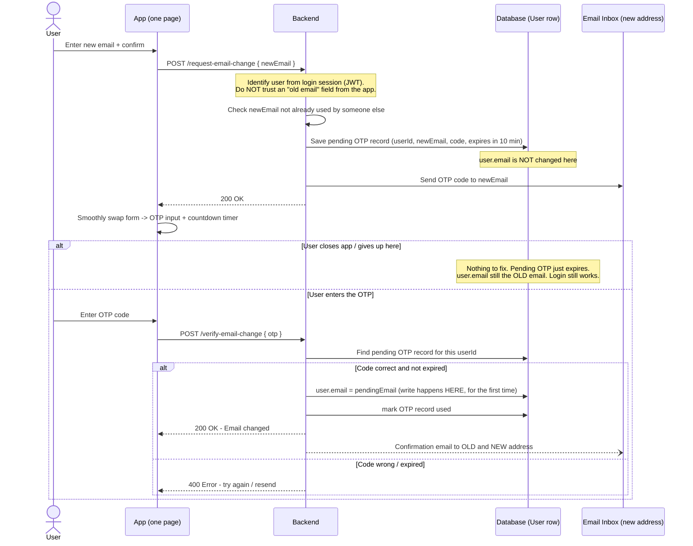

# How "Change Email" Should Work

This file explains, in plain English, how the email-update feature should behave so that
nothing breaks if the user closes the app in the middle of the process.

## 1. The bug we are fixing

**Today:** the moment the user submits the "new email" form, the backend saves the new
email into the `User` row in the database — *before* the user has proved they own that
new email (before OTP verification).

**Problem example:**

1. Stalin logs in with `stalin@old.com`.
2. He goes to Settings → Change Email, types `stalin@new.com`, and taps **Send OTP**.
3. Backend immediately does `user.email = "stalin@new.com"` in the database.
4. An OTP is emailed to `stalin@new.com`.
5. Stalin gets a phone call, closes the app, and never enters the OTP.
6. Tomorrow he tries to log in with `stalin@old.com` → **fails**, because the database
   now says his email is `stalin@new.com` (which he never confirmed he can access).

He is locked out of his own account, for a change he never finished.

**The fix:** the database should only be updated **after** the OTP is verified — never
before. Whether the UI is one page or two pages does not matter; what matters is *when
the write happens on the server*.

---

## 2. The correct flow (plain English)

Think of it like changing your email in your Gmail settings:

1. You type the new email.
2. Google sends a code to the *new* email (not the old one).
3. You type the code back into Google.
4. **Only now** does Google actually attach the new email to your account.

If you never type the code, your account never changes. Nothing to undo, nothing broken.

### Step by step for our app

| Step | What happens | Where the data lives |
|---|---|---|
| 1. User opens "Change Email" page | Nothing saved yet | Just on the page (in memory) |
| 2. User types new email + confirm, taps "Send OTP" | Backend creates a **pending** OTP record. Backend does **NOT** touch `user.email` yet. | New email is stored on the **OTP record**, not on the User |
| 3. OTP email sent to the **new** email address | Proves the user actually owns that inbox | — |
| 4. (Optional but recommended) A heads-up email sent to the **old** address: *"Someone requested to change your email to stalin@new.com. If this wasn't you, contact support."* | Protects the account even if someone stole the session | — |
| 5. UI swings from the email form to an OTP input, with a countdown timer, on the **same page** | Good UX, no page navigation needed | Still just in memory |
| 6. User types the OTP, taps "Verify" | Backend checks the OTP against the pending record | — |
| 7. If OTP is correct | **Now** backend does `user.email = pendingEmail`, marks it verified, deletes/expires the OTP record | Finally written to the User row |
| 8. If user aborts / closes app before step 6 | Nothing to clean up. The OTP record simply expires after 10 minutes. `user.email` was never touched. | Old email still works for login |

---

## 3. Diagram

---

## 4. The important rules ("flags") to follow

These are the rules mentioned earlier — written out with examples.

### Rule 1 — Write to the database only after OTP success
- ❌ Wrong: save `newEmail` to `User` when OTP is *sent*.
- ✅ Right: save `newEmail` to `User` when OTP is *verified*.
- **Why:** so an abandoned attempt never breaks login.

### Rule 2 — Don't trust the app to say who the user is
- ❌ Wrong: `updateEmail(oldEmailFromBody, newEmailFromBody)` — the "old email" comes from
  whatever the app sends.
- ✅ Right: get the user from the login token (`req.user.id`), same as every other
  "my account" action already does (e.g. `updateUserDetail`, `logout`).
- **Example of why this matters:** if the backend trusts a body field for "which account
  to change", a bug or a tampered request could target a *different* account than the
  one that's actually logged in. Using the session token removes that possibility.

### Rule 3 — Don't trust the app to say what the "verified" email was
- ❌ Wrong: at the "verify OTP" step, the app sends both `{ otp, newEmail }`, and the
  backend just believes `newEmail`.
- ✅ Right: when the OTP was created in Rule 1, the backend already wrote down what the
  new email was supposed to be (in the OTP record itself). At verify time, the backend
  reads the new email back from **its own record**, not from the app.
- **Example of why this matters:** imagine the OTP was correctly sent to
  `stalin@new.com` and correctly typed back. But at the verify step the app (by bug or by
  a malicious actor intercepting the request) sends `newEmail: "attacker@evil.com"`
  instead. If the backend blindly trusts that field, the attacker's email gets attached
  to Stalin's account. Reading the email back from the backend's own saved record
  prevents this.

### Rule 4 — Send the OTP to the *new* email, not the old one
- This proves the user can actually receive mail at the new address.
- **Example:** if Stalin mistypes `stalin@new.cmo` (typo), the OTP goes to a mailbox he
  doesn't own, he never receives it, verification never happens, and nothing changes.
  This is correct behavior — it protects him from his own typo.

### Rule 5 — Notify the old email too (recommended, not strictly required)
- Send a plain notice (no OTP needed) to the old email: *"A change to
  stalin@new.com was requested."*
- **Why:** if someone stole Stalin's session (already logged in) and tries to hijack the
  account by changing the email, Stalin still finds out via his old, safe inbox.

### Rule 6 — Rate-limit on the server, not just a UI timer
- The countdown timer on the app screen is just for looks. A user (or a script) can call
  the "resend OTP" API directly, ignoring the app's timer.
- ✅ Right: the backend itself should refuse a new OTP request if the last one was sent
  less than ~30–60 seconds ago, and should cap how many attempts/resends are allowed
  before locking the flow for a while.
- This app already has good building blocks for this (an `attempts` counter and an
  expiry time on OTP records) — the resend cooldown is the missing piece.

### Rule 7 — One page vs two pages is just UX, not a security fix
- Keeping the user on one page and smoothly swapping the email form for an OTP input is
  a nice user experience — good idea, keep it.
- But by itself it does **not** fix the original bug. The bug is fixed by Rule 1
  (server never writes early), regardless of how many screens the UI uses.
- The "security risk" of keeping the typed new email in the page's memory until
  verification is not really a risk: it is normal form state on a screen the user
  already had to log in to see, nothing more sensitive than the "Name" or "City" fields
  on the same settings screen, and it is never saved anywhere until the server confirms
  the OTP.

---

## 5. Quick summary (one paragraph)

Move the database write from "OTP sent" to "OTP verified". Identify the logged-in user
from their session token, not from a field the app sends. Store the pending new email
next to the OTP record on the server, and read it back from there at verification time
instead of trusting the app again. Send the OTP to the new email so ownership is proven,
and optionally warn the old email as a safety net. Keep the one-page UI — it's a good
idea — just make sure it's talking to a backend that follows the rules above.
